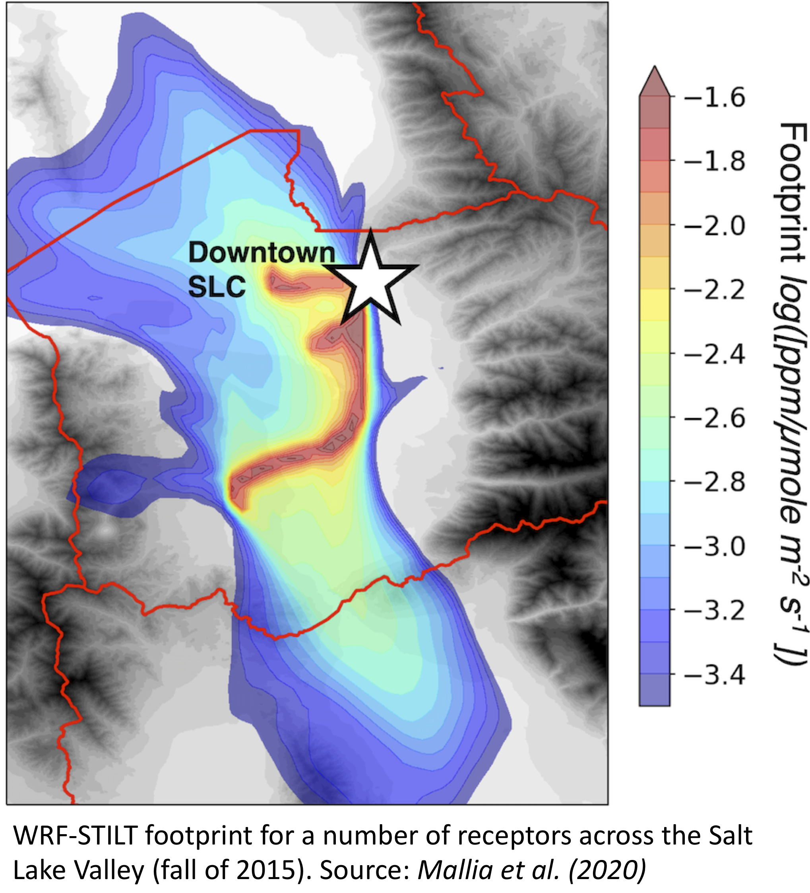
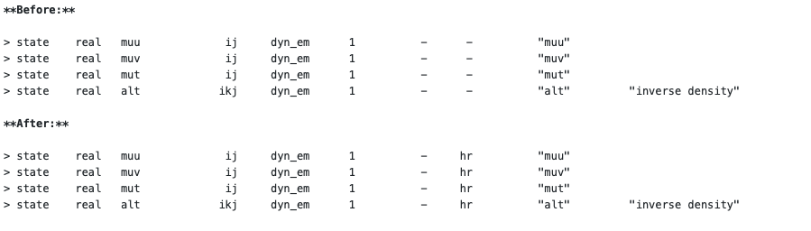

# WRF-STILT tutorial
*Written by Derek V. Mallia and Ben Fasoli* 
*Version: January 14th, 2021*

**PREFACE:** 
If you are reading this tutorial you are likely interested in running HYSPLIT-STILT with model output from the Weather Research and Forecast model (WRF; Skamarock et al. 2008). First, why *WRF-STILT*?

1) While there are a number of meteorological input files out there, many of these analyses have either limited domains and/or spatial resolution. Coarse spatial resolution can limit the ability for STILT to accurately trace air flow in areas with complex terrain and/or fine-scale meteorological circulations. WRF offers a way to downscale coarser-scale meteorological analyses to resolutions needed to resolve smaller-scale phenomena.
2) Many analyses just do not cover times you are interested. The High-Resolution Rapid Refresh model (HRRR) is a state of the art NWP model that has the grid spacing needed to resolve most mesoscale circulations. However, HRRR has only been operational since 2015. If you want to investigate something before that, you could be out of luck!
3) Model and model analyses have biases. There are just some meteorological phenomena that these analyses struggle with. For example, NWP models have a hard time getting snowpack correct. Across the Intermountain West, this snowpack can be really important driver for persistent cold-pool inversions in mountain-valley basins. Many times, snow depth is a quantity that can be better prescribed in a model like WRF, which may give the model a better chance at resolving persistent cold-pool inversions, which can ultimately impact local transport. This is just one of many examples why someone may want to use WRF over other model analyses.

*However, there are some cavaets...*
1) WRF is not easy to use. If you have a colleague that can run WRF for you, lucky you! In most cases, this is not an option. This tutorial is not meant to show you how to become a proficient WRF modeler as this can take months to even years of practice. The most this tuturial will do is show you how to convert output files already generated from WRF. More information on WRF can be found [here!](https://www2.mmm.ucar.edu/wrf/users/)
2) Always look at your model output with a careful eye. Just because WRF ran, does not mean it produced something realistic (most time it does, thankfully). Always be sure to evaluate your model data with observations!
3) WRF is awesome, I've built my career around WRF. But running WRF may not make sense for every application. Be sure check out some of the other fantastic meteorological analyses out there and first see if they make sense for your application/research! It may not be necessary to re-invent the wheel!

Before we conclude, the authors would like to acknowledge John C. Lin, Chris Loughner, and Thomas Nehrkorn for their support on WRF-STILT related activities.
With that said, let's get you up and running with WRF. 

# Before running WRF

Results in Nehrkorn et al. (2011) showed that mass conversation within STILT can be drastically improved by using time-average winds instead of the instantanous winds that are often produced for each output frame. As a result, we encourage WRF-STILT users to modify the WRF Registry so that time-average winds are added to the WRF output file. 

To activate the history output `hr` for the variables needed by the ARL converter, users should change the following lines within `./Registry/Registry.EM_COMMON`: 

The following lines should also be added added to the wrf namelist `namelist.input` under the &dynamics section:

`do_avgflx_em                        = 1, 1, 1, 1, 1, 1, 1, 1, 1,` 
`do_avgflx_cugd                      = 1, 1, 1, 1, 1, 1, 1, 1, 1,` 

Finally, note that any time a change is made to the WRF Registry, WRF will need to be recompiled.
 
 

# Compiling the WRF ARL converter 

If you are installing STILT v2.0 using pre-compiled libraries (recommended), no additional action is needed to set up the `arw2arl` executable, which should be located in STILT v2.0's `./exe` directory. If you decide to compile your HYSPLIT-STILT code from source, you will need to make additional changes to the `Makefile.inc` by linking netCDF environment paths to the appropriate libraries:

For example:

> NETINC= -I/uufs/chpc.utah.edu/common/home/lin-group12/software/local/include 
> NETLIBS= -L/uufs/chpc.utah.edu/common/home/lin-group12/software/local/lib -lnetcdff	# for netCDF4 

Once the appropriate paths have been set for `NETINC` and `NETLIBS`, run the following commands to compile the arw2arl code:

> (cd data2arl/arw2arl && make)

Once the compilation finishes, check the `exec` directory to ensure that the arw2arl executable has been created. 

 
 

# Running the WRF ARL converter 

The next step of this guide is to show you how to run the `arw2arl` code on WRF output files (which are hopefully in in netcdf format). In order to run the ARL converter, you will need 3 files:
1) Your WRF output file(s)
2) The ARL converter configuration file `WRFDATA.CFG`
3) And of course, the ARL executable `arw2arl`

The `WRFDATA.CFG` file is responsible for configuring the ARL converter to run with your WRF input files. Most of the times, this can be left as the default, which has been provided below. However, there are some instances were you may need to make changes to this file, such as using instantaneous winds, TKE variables, and so on. More documentation on how to setup the configuration can be found here: https://github.com/tartanrunner25/WRF-STILT_tutorial/blob/main/Note-arw2arl.pdf

For now, stick with the default `WRFDATA.CFG` file, which has been provided within the repository (top level).

In order to run the executable with the file of interest you simply need to execute the `arw2arl` code, followed by the input WRF filename and path `-i`, the name of the file that will be created `-o`, and a flag that specifies the configuration file type that we will be using (`-c1`, `-c2`, or `-c3`). For time-average winds, we use `-c2`. The line that we execute in our terminal line should look something like this:

`./arw2arl -i$WRF_FILE_PATH_HERE/WRF_FILE_NAME_HERE -c2`

 
 

# Running HYSPLIT-STILT with WRF ARL files

:warning: If you are using HYSPLIT-SILT v2020-05-24 (version 5), there may be compatibility issues with ARL converted WRF files. :warning:

# References

Nehrkorn, T., J. Eluszkiewicz, S. C. Wofsy, J. C. Lin, C. Gerbig, M. Longo, and S. Freitas, 2010: Coupled weather research and forecasting - stochastic time-inverted lagrangian transport (WRF-STILT) model. Meteor. Atmos. Phys., 107 (1), 51-64, doi:10.1007/s00703-010-0068-x.

